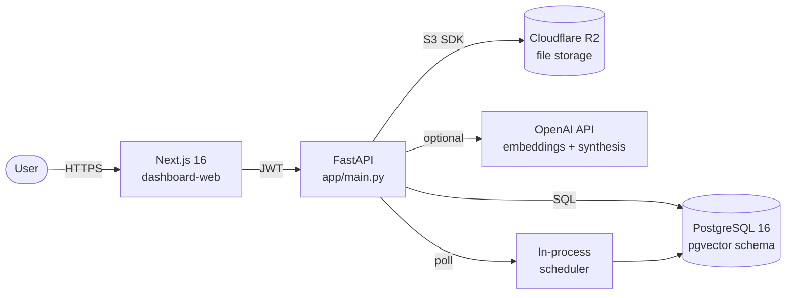

# SourceHero

**A self-hosted research workspace that turns your saved webpages, RSS feeds, and PDFs into a searchable, citable knowledge base.**

[](LICENSE)
[](pyproject.toml)
[](dashboard-web/package.json)
[](tests/)
[](docker-compose.yml)

Built with **FastAPI · PostgreSQL · Next.js · Supabase Auth · Cloudflare R2 · Docker**. An OpenAI key is optional: without it, the app falls back to lexical retrieval and extractive answers; with it, you get synthesised briefings. The production schema defines a pgvector column and HNSW index for semantic search — see *What I'd do differently* for its current runtime status.

---

## Preview

| Home | Library | Ask |
|---|---|---|
|  |  |  |

| Capture | Briefing |
|---|---|
|  |  |

---

## Why I built this

I kept running into the same problem: I'd save articles, papers, and links faster than I could organise them. Bookmarks piled up, PDFs sat in Downloads, and RSS feeds went unread. When I actually needed something back, I'd spend more time digging through folders than the original research would have taken.

I wanted something narrower than a generic AI chatbot — a tool that works only with sources I explicitly trust, and always shows where its answers come from. Every claim is grounded in a chunk you can click through to.

---

## What this demonstrates for data engineering

- **Multi-format ingestion & extraction** — webpages, RSS feeds, PDFs, and notes are captured and normalized into chunks through one pipeline (`app/` ingestion routers + services).
- **Idempotent deduplication** — every captured source is fingerprinted by content hash, so re-ingesting the same material never duplicates the library.
- **Retrieval architecture** — lexical retrieval is live; a pgvector column + HNSW index is defined in the production schema, with semantic search tracked as the next milestone (see *What I'd do differently*).
- **Storage layering** — relational data + vectors in PostgreSQL, source files in Cloudflare R2 (S3-compatible, zero egress fees).
- **Multi-tenant scoping** — every query is isolated per authenticated user via Supabase JWT claims, enforced at the service layer.
- **Operational pipeline** — scheduled ingestion/briefing jobs run on a configurable in-process poller; local stack boots with `docker compose`.

## Key features

- **Capture** — Add webpages, RSS feeds, PDFs, or quick notes from the clipboard.
- **Index** — Chunks, deduplicates by content hash, and builds a lexical index (semantic-search schema ready).
- **Ask** — Search across your library, get answers with clickable citations back to the source chunk.
- **Briefing** — Generate evidence-grounded summaries on any topic, with the same citation trail.
- **Schedule** — Recurring ingestion and briefing jobs run in an in-process poller.
- **Multi-tenant** — Every query is scoped to the authenticated user via Supabase JWT.

---

## Architecture



**Data flow:** `web / RSS / PDF → extract + normalize → content-hash dedup → chunk → lexical index → tenant-scoped retrieval with citations`

I went with **PostgreSQL** instead of a dedicated vector database to keep the stack simple — one database handles structured data, with the pgvector column + HNSW index defined in the schema for the semantic-search milestone. **Cloudflare R2** stores uploaded files (S3-compatible, no egress fees). **Supabase Auth** issues JWTs so the backend never has to manage credentials itself.

---

## Tech stack

| Layer | Choice | Why |
|---|---|---|
| API | **FastAPI** | Async, Pydantic-typed contracts, automatic OpenAPI docs |
| Database | **PostgreSQL 16** (pgvector schema; SQLite in tests) | One DB for relational data; vector column + HNSW index defined for semantic search |
| Auth | **Supabase Auth (JWT)** | No password storage, no session management, RS256 verification on the backend |
| Object storage | **Cloudflare R2** | S3-compatible API, zero egress fees |
| Frontend | **Next.js 16 + React 19 + TypeScript** | App Router, RSC where useful, deploys to Vercel in one click |
| Styling | **Tailwind v4** | Utility-first, no design-system overhead for a focused app |
| Container | **Docker Compose** | One command to bring up Postgres + MinIO for local dev |
| Tests | **pytest** | 47 test functions across 13 modules: ingestion, chunking, dedup, hybrid retrieval, citations, schedules, library |
| LLM (optional) | **OpenAI** | Embeddings + answer synthesis. App fully functional without it. |

---

## Repository layout

```
SourceHero-AI/
├── app/                    # FastAPI backend (routers, services, models, schemas)
├── dashboard-web/          # Next.js 16 frontend (App Router, Tailwind, Supabase client)
├── tests/                  # pytest suite (47 tests, 13 modules)
├── infra/supabase/         # Schema SQL (idempotent, run on cold start)
├── docs/assets/            # Screenshots used in this README
├── docker-compose.yml      # Local Postgres + MinIO
└── pyproject.toml          # Backend dependencies and tool config
```

---

## Running locally

```bash
git clone https://github.com/JeremyL691/SourceHero-AI.git
cd SourceHero-AI

# Start PostgreSQL + MinIO (local S3)
docker-compose up -d

# Backend
python3.11 -m venv .venv
source .venv/bin/activate
pip install -e ".[dev]"
cp .env.example .env
# Edit .env: set DATABASE_URL, SUPABASE_*, R2_*, OPENAI_API_KEY (optional)
uvicorn app.main:app --reload

# Frontend
cd dashboard-web
npm install
cp .env.example .env.local
npm run dev
```

Then open http://localhost:3000.

---

## Testing

```bash
source .venv/bin/activate
pytest -q
```

47 test functions across 13 modules cover ingestion (web, RSS, PDF), chunking, deduplication, hybrid retrieval, citations, schedules, and library scoping. Known gap: auth-flow integration tests are not yet covered (see *What I'd do differently*).

## Cloud deployment

The app expects three managed services plus an auth provider. Pick any combo that fits.

| Service | Suggested provider | Required env vars |
|---|---|---|
| Postgres (with pgvector) | Supabase, Neon, Railway | `DATABASE_URL` |
| Auth (JWT) | Supabase Auth | `SUPABASE_URL`, `SUPABASE_ANON_KEY`, `SUPABASE_SERVICE_KEY` |
| Object storage (S3-compatible) | Cloudflare R2 | `R2_ACCOUNT_ID`, `R2_ACCESS_KEY_ID`, `R2_SECRET_ACCESS_KEY`, `R2_BUCKET_NAME` |
| Frontend | Vercel | `NEXT_PUBLIC_API_URL` |
| Backend | Railway, Fly.io, Render | All of the above + `OPENAI_API_KEY` (optional) |

### One-time setup

```bash
# 1. Enable pgvector on your Postgres instance
psql "$DATABASE_URL" -c "CREATE EXTENSION IF NOT EXISTS vector;"

# 2. Apply the schema (idempotent)
psql "$DATABASE_URL" -f infra/supabase/schema.sql

# 3. Set environment variables on your backend host (see .env.example)
# 4. Configure CORS_ORIGINS to your frontend URL
```

### Run order on cold start

1. Postgres + pgvector reachable → backend starts (`uvicorn app.main:app`)
2. Backend runs `init_db()` (creates missing tables) and starts the scheduler poller
3. Frontend hits `/health` to confirm the API is up

The backend uses `Base.metadata.create_all()` on startup, so schema migrations are additive only. For destructive changes, edit `infra/supabase/schema.sql` and apply manually — Alembic is listed in dev dependencies but not yet wired up.

### Setting `OPENAI_MODEL`

The default model is configurable via the `OPENAI_MODEL` env var or in the Settings UI once you're logged in.

---

## What I'd do differently

- **Semantic search is schema-ready, not runtime-ready** — embeddings are computed (OpenAI) but not yet persisted: `embedding_id` tracks indexed chunks and `infra/supabase/schema.sql` defines the pgvector column + HNSW index. Persisting vectors and switching `semantic_chunk_scores` to a real vector query is the next milestone; until then retrieval is lexical.
- **Background jobs** — The scheduler runs in-process right now. For production I'd pull in Celery or a proper job queue.
- **Frontend state** — I'm fetching data on every page load. A proper client-side cache (React Query / SWR) would make the UI feel snappier.
- **Tests** — The suite covers the core pipeline (chunking, dedup, hybrid retrieval, citations, schedules, library) but I'd want more integration tests, especially around the auth flow.
- **Migrations** — Alembic is installed but not wired up. Right now `Base.metadata.create_all()` handles additive schema; destructive changes need a manual SQL run.

---

## About me

Built by **Jeremy Liu** · UC Berkeley '27 · [GitHub @JeremyL691](https://github.com/JeremyL691)

If you're reviewing this for a role, the things I'd want to flag are: end-to-end ownership of a multi-tenant backend (FastAPI + Postgres + R2), a working RAG pipeline with hybrid retrieval and click-through citations, and a clean Next.js frontend that talks to it through JWT-scoped APIs.

---

## License

MIT